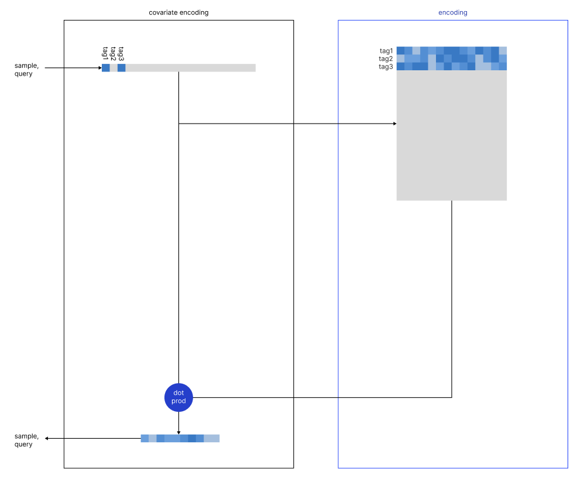

# Please cite
Algorithm: **Covariate Search**<br>
Author: **Michelangiolo Mazzeschi**<br>
Published: **2nd September 2024**

# simtag, covariate search made easy

We aim introduce the following technologies:
- **covariate search**
- **encrypted coviarate search**
- **covariate tagging**

The following library [is based on the following technical article](https://medium.com/towards-data-science/introducing-semantic-tag-filtering-enhancing-retrieval-with-tag-similarity-4f1b2d377a10), and aims to expand semantic search **from the limited one-to-one approach** into a **many-to-many approach (covariate search)**, using vector-encoded relationships to maximize the overall relevance of the tags.


This search aims to improve the classic **hard filtering** , which lacks flexibility in providing alternative results when the **regular search cannot retrieve enough samples**.


## Covariate Search

This algorithm uses a new encoding method called **covariate encoding**, which employs an optional PCA module to provide high scalability to semantic tag filtering.

To provide better insights into the definitions:
- **sample**: the list of tags associated with an element in our database (ex. a Steam game). We search through our collection of thousands of existing samples.
- **query**: the list of tags that the user has input, the objective is to find a sample matching those tags.

In most encoding algorithms, we encode both queries and samples using the same algorithm. However, each sample contains more than one tag, each represented by a different set of relationships **that we need to capture in a single vector**.



This version of the encoding process differs from previous version, as it is now mathematically accurate

### PCA module

The encoding algorithm behaves differently when a PCA module has been applied to the data:


We are still in the process of understanding what are some of the improvements that take plce during this process.

# using the simtag library

The library contains a set of pre-defined modules to facilitate the formatting and the computation of either the co-occurence or encoded matrix, as well as an encoding and search module given the parameters of your sample. If you already want to test it on a working example, you can try the jupyter notebook **notebooks/steam-games.ipynb**, which uses a live example from 40.000 Steam samples.

### simtag object

A note before starting: during the instantiation of our engine we will immediately need to input the sample list (containing the list of tags for every sample). The format of the sample_list is the following:
```
sample_list = [
    ['Adventure', 'Simulation', 'RPG', 'Strategy', 'Singleplayer', 'Classic'],
    ['Action', 'Indie', 'Adventure', 'Puzzle-Platformer', 'Arcade', 'Zombies'],
    ['Indie', 'Casual'],
    ['Casual', 'Platformer', 'Hand-drawn'],
    ...
]
```
Our first step will be to import and initiate the **simtag object**. 
```
from simtag.filter import simtag_filter

# initiate engine
# initiate engine
engine = simtag_filter(
    sample_list=sample_list,
    model_name='sentence-transformers/all-MiniLM-L6-v2'
)
```
We can now use all modules on top of the engine instance. 

### computing the co-occurence matrix

Our next step is to generate the relationship matrix - we have added the option to compute the co-occurence matrix from the library (note that I am using **Michelangiolo similarity** as a mean to computing it, which is not a highly scalable option, but the same relationship can be extracted with a variety of more advanced methods, such as neural network, ex. Embeddings), which stores the relationship between existing pair of samples using IoU (Intersection over Union).

```
# if not existing, compute M
M, df_M = engine.compute_M()
processing tags: 100%|██████████| 446/446 [1:18:52<00:00, 10.61s/it]
```
Be mindful of storing the metrix in a parquet file for quick retrieval, considering the long time it may be required to compute it again.
```
df_M.to_parquet('M.parquet')
```
Once you store the matrix, this process only has to be done once, as you can now retrieve it and store it into engine with the following code:
```
# if already existing, load M
df_M = pd.read_parquet('notebooks/steam-games/M.parquet')
engine.load_M(df_M, covariate_transformation='dot_product')
```
For convenience, we will use df_M to store and retrieve the relational matrix, however, in the backprocess of the library, this will be converted into a numpy array. Essentially, df_M is used as a wrapper for ease of use. The same format can be built using pre-trained encoders (lookt at twitter-news **for a scalable example on 53.300 tags**):


Let us visualize our co-occurrence matrix **in a much more comprehensible format** (extra code in the steam-games notebook):


### compute NHSW (navigable hierarchical small world)

As explained in the article, we are using Covariate encoding to retrieve the sample in a vector space. To prepare our samples for a vector search in a python environment we first need to encode them, then build our NHSW by making use of **scikit-learn Nearest Neighbor** function, where **k** indicates the number of samples to be returned.
```
sample_vectors = engine.encode_samples(sample_list)
nbrs = engine.compute_nbrs(sample_vectors, k=5)
```
We can now perform a **semantic tag search** on our samples.

## naive

This format of **semantic tag search** assigns an equal weight to each of our query tags:

```
query_tag_dict = [ 'Shooter', 'Dark Fantasy', 'Sci-fi']

# perform search
query_vector = engine.encode_query(list_tags=query_tag_dict, allow_new_tags=False, print_new_tags=True)
indices, search_results = engine.soft_tag_filtering(nbrs_covariate, sample_list, query_vector)
for s in search_results[0:5]:
    print(s)
```
The first result (k=5, so there will be other 4 we can explore) looks like it contains all our tags, and, additional tags that are related to our query tags.
```
[
    ['Action', 'FPS', 'Sci-fi', 'Shooter']
    ['Action', 'Third-Person Shooter', 'Sci-fi', 'Aliens', 'Space', 'Great Soundtrack', 'Shooter', 'Atmospheric', 'Futuristic']
    ['Action', 'FPS', 'Sci-fi', 'Shooter', 'First-Person', 'Singleplayer', 'Space', 'Difficult']
    ['Action', 'Shooter', 'Sci-fi', 'Classic', 'First-Person', 'FPS', 'Arcade']
    ['Action', 'FPS', 'Shooter', 'Singleplayer', 'First-Person', 'Arena Shooter', 'Futuristic', 'PvE', 'Robots', 'Sci-fi', 'Difficult']
    ...
```

## weighted

On the contrary, this format of **semantic tag search** assigns a different weight to each of our query tags. Because we are combining the vectors after performing the **covariate encoding** we can easily combine them using different weights:

```
query_tag_dict = {
    'Voxel' : 0.8,
    'Shooter' : 0.2,
    'Open World' : 0.6,
}

# perform search
query_vector = engine.encode_query(dict_tags=query_tag_dict)
indices, search_results = engine.soft_tag_filtering(nbrs_covariate, sample_list, query_vector)
for s in search_results[0:5]:
    print(s)
```
Hopefully, we can see quite clearly how the tags of te returned sample are more related to Open World, rather than Shooter:
```
[
    ['Adventure', 'Action', 'Simulation', 'Open World', 'Survival', 'Voxel', 'Sci-fi', 'Early Access']
    ['Open World', 'Massively Multiplayer', 'Building', 'Space Sim', 'Simulation', 'Sandbox', 'Space', 'Sci-fi', 'Action', 'Early Access', 'FPS', 'Voxel', 'Crafting', 'Destruction', 'Programming', 'Exploration', 'Robots', 'Multiplayer', 'Open World Survival Craft', 'First-Person']
    ['Early Access', 'Adventure', 'Sandbox', 'MMORPG', 'Voxel', 'Crafting', 'Base-Building', 'Massively Multiplayer', 'Procedural Generation', 'Action RPG', 'FPS', 'Third-Person Shooter', 'Colorful', 'First-Person', 'Third Person', 'Open World', 'Character Customization', 'Combat', 'Inventory Management', 'PvE']
    ['Strategy', 'Action', 'Adventure', 'Simulation', 'Survival', 'Open World', 'Voxel', 'Sci-fi', 'FPS']
    ['Survival', 'Zombies', 'Voxel', 'Open World', 'Open World Survival Craft', 'Multiplayer', 'Post-apocalyptic', 'Base-Building', 'Online Co-Op', 'Exploration', 'Simulation', 'Sandbox', 'Building', 'Strategy', 'Character Customization', 'FPS', 'Procedural Generation', 'Tower Defense', 'Action', 'Early Access']
...
```